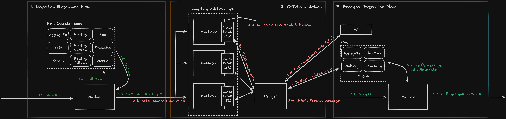

# CW Hyperlane

[](https://codecov.io/gh/many-things/cw-hyperlane)
[](https://crates.io/crates/hpl-interface)

## Overview

- [Architecture](#architecture)
- [Project Structure](#project-structure)
- [Prerequisites](#prerequisites)
- [How to build](#how-to-build)
- [How to test](#how-to-test)

## Architecture



## Project Structure

```
├── contracts
│   │
│   ├── core
│   │   ├── mailbox
│   │   └── va
│   │
│   ├── hooks
│   │   ├── aggregate
│   │   ├── fee # protocol fee
│   │   ├── merkle
│   │   ├── pausable
│   │   ├── routing
│   │   ├── routing-custom
│   │   └── routing-fallback
│   │
│   ├── igps # also this is a part of `hook`
│   │   ├── core
│   │   └── oracle
│   │
│   ├── isms
│   │   ├── aggregate
│   │   ├── multisig
│   │   ├── pausable
│   │   └── routing
│   │
│   ├── mocks # for testing
│   │   ├── mock-hook
│   │   ├── mock-ism
│   │   └── mock-msg-receiver
│   │
│   └── warp
│       ├── cw20
│       └── native
│
├── integration-test
│
├── packages
│   │
│   ├── connection # same as `MailboxClient` of evm implementation
│   ├── interface # package for contract interfaces (external)
│   ├── ownable
│   ├── pausable
│   └── router
│
├── scripts # useful scripts for development (e.g. code uploading. contract deployment)
│
└── ts
    └── sdk # typescript sdk for contract integration. (auto generated via ts-codegen)
```

## Prerequisites

- rust (wasm32-wasm32-unknown target)
- go 1.20 or higher
- llvm-cov

## How to build

```bash
make install-dev

make build
```

## How to test

```bash
cargo test --workspace --exclude hpl-tests

cargo llvm-cov --workspace --exclude hpl-tests
```
